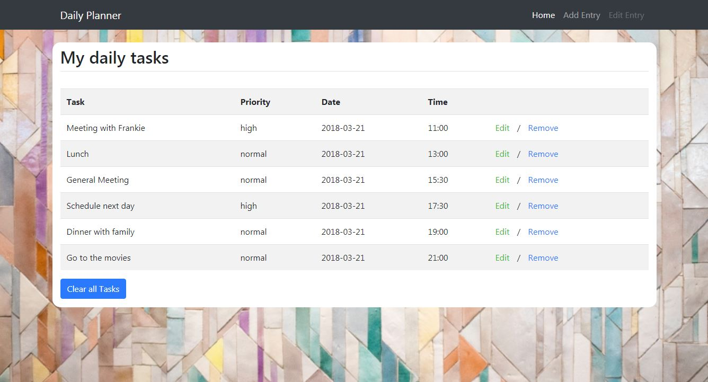

 
## Synopsis

This is a Daily Planner interface.

It can be a great tool to help you stay organised throughout your days.

This Daily Planner was created using:

* HTML
* CSS
* Bootstrap
* jQuery

## Live Demo

To see the live demo, please [click here](https://patriciageo3.github.io/daily-planner/).

## Functionality

* Add/ edit/ remove items one by one when done
* Clear All items with one click
* Items are being shown sorted on 4 criteria: date, time, priority and alphabetically.

## Authors

Patricia Georgescu

## License & Copyrights
Image from Unsplash.

## Quick Live Preview
